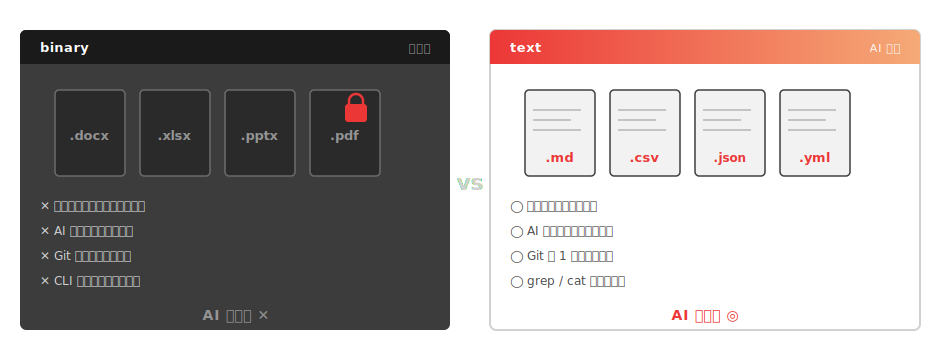
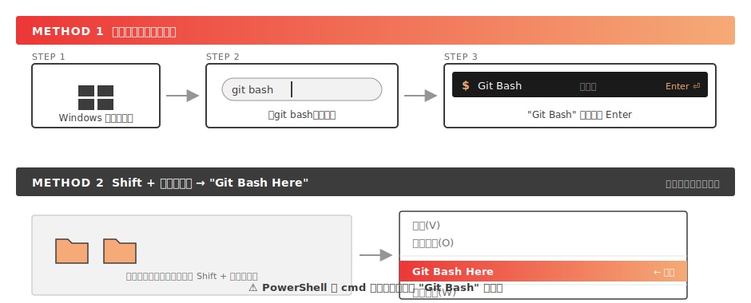
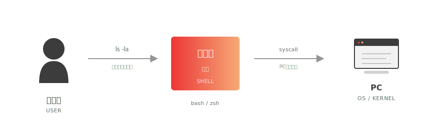
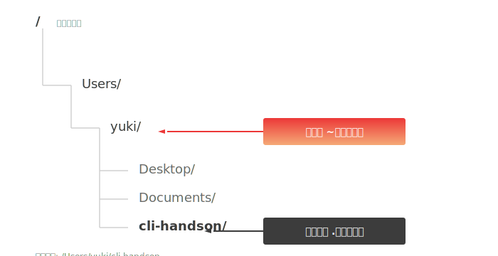

<!-- _class: cover -->

<p class="eyebrow">MINEDIA / TECH SESSION — 2026</p>

# CLI入門講座
## 〜Claude Code をもっと使いこなすための、CLI 入門 60 分〜

<p class="eyebrow" style="margin-top:2em">松倉 友樹 — Minedia, Inc. CTO</p>

---

<!-- _class: section -->

<p class="eyebrow">SECTION</p>
<div class="section-number">00</div>

# なぜ今、CLI なのか

---

## まず、結論から

<div class="callout">

AIエージェント時代に、**CLI を知る人と知らない人の生産性は 16 倍以上**違う。
その差は毎月毎月、複利で広がっていく。

</div>

過去：CLI は "エンジニアの道具"
**今：CLI は "AIに仕事を任せる全員の道具"**

AIエージェント（Claude Code、Cursor、各種MCP）は、GUIではなく **テキスト＝コマンドライン** を介して動く。AIに業務を委任しようとすると、必ずどこかで「ターミナル」にぶつかる。

---

## 同じツール・同じ料金・同じ給料 — でも生産性は違う

|  | CLI を使えない人 | CLI を使える人 |
|---|---|---|
| Claude Code で自動化できる業務 | 月 3 時間 | 月 50 時間 |
| 100 ファイルのリネーム | 2 時間（手作業） | **3 秒**（1 コマンド） |
| AI スクリプトをもらったとき | 「動かし方が分からない」 | 即実行・改造・定期化 |
| 生産性（同条件で） | ×1 | **×16** |

<p class="eyebrow" style="margin-top:1em">同じツール・同じ料金・同じ給料 — でも、差は毎月複利で開く</p>

---

## さらに：Claude Code の "裏側" もまったく違う


---

<!-- _class: quote -->

> AI エージェントは「英語しか喋れない、超優秀なアシスタント」。
> CLI はその英語そのもの。
> 英語が読み書きできない人は、せっかくの優秀な助手に **1 ミリも仕事を頼めない**。

<p class="attribution">今日の 60 分は、その「英語」のいちばん基礎を体に入れる時間。</p>

---

## 🎯 この講座のターゲット

**Claude Code は既に使っている。でも、もっと使いこなしたい人**のための講座です。

**こんな人に向けて：**
- Claude Code に頼んで出てきたコマンドの**意味がわからない**
- 「ターミナルでこれを実行してください」で**詰まる**
- カレントディレクトリ・環境変数・パス と聞いて**ピンと来ない**
- 100 ファイルの処理を GUI で 1 個ずつクリックしている

**前提：**
- Claude Code はインストール済み（簡単な使い方は知っている）
- 「黒い画面が怖い」レベルで OK
- ノート PC を持参（Mac / Windows いずれも対応）

---

## 今日のゴール

受講後、以下ができるようになります。

1. ターミナル（Git Bash on Windows / macOS ターミナル）を**自分で開ける**
2. カレントディレクトリ・ホームディレクトリの概念を**説明できる**（`~` の意味も）
3. 基本のファイル / ディレクトリ操作コマンドが**打てる**
4. `find` / `grep` で **探せる**（= AI の心臓部と同じこと）
5. 環境変数 `PATH` を**覗いて意味がわかる**
6. ★ **Claude Code を自分のターミナルから起動して、業務を任せられる**

---

## 60 分のタイムテーブル

| 時刻 | 分 | セクション |
|---|---|---|
| 0:00 | 6  | 00. オープニング（今ここ） |
| 0:06 | 4  | 01. CLI と GUI の違い |
| 0:10 | 10 | 02. シェルとコマンドの基礎＋ショートカット |
| 0:20 | 13 | 03. ファイル・ディレクトリ操作 |
| 0:33 | 5  | 04. 探す：`find` と `grep` |
| 0:38 | 3  | 05. 環境変数 |
| 0:41 | 9  | 06. プログラムを書いて動かす ★ゴール |
| 0:50 | 2  | 07. 次に効くコマンド集 |
| 0:52 | 5  | 08. 応用デモ |
| 0:57 | 3  | 09. クロージング |

---

## 🔧 ハンズオンの前提：環境チェック

今日のハンズオンを動かすために、以下を確認してください。

**Mac / Linux**
ターミナルは標準搭載。**追加インストール不要**。

**Windows**
[Git for Windows](https://git-scm.com/download/win) をインストール → **Git Bash** が入る（事前案内で完了済み）。

**全員：Claude Code**
インストール済みの前提です。ターミナルで `claude --version` で確認できます。

**事前確認**：ターミナルを開いて
```bash
claude --version
```
→ バージョンが表示されれば準備 OK。

<div class="callout">

うまく出ない場合は今のうちに講師か Slack `#ai` まで連絡してください。

</div>

---

<!-- _class: section -->

<p class="eyebrow">SECTION</p>
<div class="section-number">01</div>

# CLI と GUI の違い

---

## CLI と GUI — 2つの「PCの動かし方」


|  | GUI | CLI |
|---|---|---|
| 入力 | マウス（指差し） | キーボード（言葉） |
| 大量処理 | 苦手（1個ずつクリック） | 得意（1コマンドで何百個も） |
| 自動化 | 難しい | カンタン |
| AI との相性 | 悪い | 抜群 |

---

## もう1つの比較軸 — text vs binary

CLI vs GUI が「**操作方法**」の比較なら、text vs binary は「**保存形式**」の比較。



<div class="callout">

**同じ内容なら、可能な限り text 形式を選ぶ**と、AIに任せやすい。
例：Word の議事録 → Markdown、Excel の管理表 → CSV、PowerPoint → **Marp（このスライドがまさにそれ）**

</div>

---

## 🖐 ハンズオン ①：ターミナルを開く



**Mac の場合**: `Cmd + Space` → `ターミナル` と入力 → Enter

**動作確認**: 全員でこれを打ってください

```bash
echo Hello
```

→ `Hello` が表示されたら成功！

<!--
講師ノート:
- Windowsユーザーで Git Bash が見つからない場合：Git for Windows のインストール失敗が疑われる。再インストールを案内。
- Windowsの「PowerShell が真っ先に出てしまう」あるあるに注意。Git Bash のアイコンを口頭で説明（黒地に $ マークの白いアイコン）。
-->


---

<!-- _class: section -->

<p class="eyebrow">SECTION</p>
<div class="section-number">02</div>

# シェルとコマンドの基礎

---

## シェルとは

**シェル = 「あなた」と「PC」の間に立つ通訳**



代表的なシェル：**bash**（Git Bash on Windows / Linux）、**zsh**（macOS 標準）。
今日は**どちらでも OK**。入門範囲の打ち方はほぼ同じ。

> Windows ユーザーは **PowerShell ではなく Git Bash** を使ってください。
> Mac と同じコマンドがそのまま動くので、講座中に方言を気にする必要がなくなります。

---

## コマンドのフォーマット — これが全ての基本

<div class="callout">

CLI で打つもの = **スペースで区切った単語の列**。
一番左がコマンド、それより右はぜんぶ追加指示。

</div>


---

## `--help` の慣習

<div class="callout">

「このコマンド、何ができるんだっけ？」と思ったら、まず `--help` を付ける。

</div>

```bash
ls --help
git --help
claude --help
```

ほぼ全てのコマンドが、慣習的に `--help` で**使い方を表示**してくれる。

→ **辞書を引くように**コマンドを学べる。
　 これを知っているだけで、未知のコマンドが怖くなくなる。

補足：
- Mac / Git Bash では `man ls` でさらに詳しいマニュアルが見られる
- 終了するときは `q` キー

---

## 🖐 ハンズオン ②：基本コマンド 5 つ + `--help`

| コマンド | 意味 | 試す |
|---|---|---|
| `pwd` | 今いる場所を表示 | `pwd` |
| `ls`  | 中身を一覧 | `ls`、`ls -la` |
| `cd`  | 場所を移動 | `cd ~` |
| `echo` | 文字を表示 | `echo Hello, World` |
| `cat` | ファイルの中身を表示 | （後で使う） |

最後に必ず：

```bash
ls --help
```

→ 大量のオプションが出てくる。**全部覚えなくていい**。
　 「ここを見ればいい」と知ることが大事。

💡 **Tab キーで補完できる**、**↑キーで履歴が出る** ことも今日中に覚える。

---

## ⌨️ ショートカットキー — ハマったときの命綱

| キー | 効果 |
|---|---|
| **`Ctrl + C`** | 実行中のコマンドを止める ★まず覚える |
| **`Ctrl + L`** | 画面をクリア（`clear` と同じ） |
| **`Ctrl + R`** | 履歴をインクリメンタル検索 |
| **`Ctrl + A` / `Ctrl + E`** | 行頭 / 行末へカーソル移動 |
| **`Ctrl + D`** | ターミナルを閉じる（`exit` と同じ） |

<div class="callout">

特に **`Ctrl + C`** は最重要。
「何か止まらない！」「ハマった！」と思ったらまず `Ctrl + C`。

</div>

<!--
講師ノート:
- Ctrl+C は実演する（無限ループするコマンドを打って止めて見せる）。例：sleep 100 を Ctrl+C で止める。
- Ctrl+R は履歴検索デモを1回見せると印象に残る。
-->


---

<!-- _class: section -->

<p class="eyebrow">SECTION</p>
<div class="section-number">03</div>

# ファイル・ディレクトリ操作

---

## カレントディレクトリ＝「今いる場所」

すべてのコマンドは、**カレントディレクトリ**を基準に動く。

- **カレントディレクトリ**：今あなたが立っている場所（`pwd` で確認）
- **ホームディレクトリ**：あなたの「家」
  - Mac: `/Users/<あなた>`
  - Windows: `C:\Users\<あなた>`（`C:` は PC のメインドライブの意味）
  - Git Bash で見ると `/c/Users/<あなた>` の形式になる

> 社用PCで OneDrive 同期が ON だと、ホームが `OneDrive - 会社名` 配下になることがあります。困ったら社内 Slack `#ai` で。

---

## Claude Code とカレントディレクトリ

Claude Code は、**起動した時点のカレントディレクトリを起点**に動く。

- そのディレクトリ ＋ 配下のファイルが「作業対象」
- **上位や別のディレクトリには基本アクセスしない**（必要なら都度パーミッションを求められる）
- つまり、カレントディレクトリは Claude Code にとって**最重要のコンテキスト**

```bash
# プロジェクトA で起動 → A の中だけ見える
cd ~/project-a
claude

# プロジェクトB で起動 → B の中だけ見える
cd ~/project-b
claude
```

<div class="callout">

**どこで起動するかで、Claude Code の "視野" が決まる。**
だから本日のハンズオン⑥でも、まず `cd ~/cli-handson` してから `claude` を起動する。

</div>

---

## ホームディレクトリの省略記号 — `~`（チルダ）

ホームのパスは長い → これを表す**特別な記号**がある：

<div class="callout">

**`~`** = ホームディレクトリ。読み方は **「チルダ」**（英語: tilde）

</div>

**`~` の入力方法（地味だけどここでハマる人多い）**
- Mac（JIS配列）: `Shift + ^`（数字「0」の右隣、「ほ」のキー）
- Mac（US配列）: `Shift + `` `（数字「1」の左、Tab の上）
- Windows（JIS配列）: `Shift + ^`（数字「0」の右隣、「へ」のキー）
- Windows（US配列）: `Shift + `` `（数字「1」の左）

**使い方：**
- `cd ~` で、どこにいても**一発でホームに戻れる**
- `cd ~/Documents` のように、ホーム起点の道順も書ける
- ターミナルのプロンプトに `~` と出ていたら = 「今ホームにいる」サイン

---

## 絶対パスと相対パス



- 絶対パス：`/Users/yuki/cli-handson`（住所をフルで）
- 相対パス：`cli-handson`（今いる場所からの道順）
- `.` = カレント（今ここ）／ `..` = 一つ上

---

## 🖐 ハンズオン ③-A：作業フォルダを作る

```bash
cd ~                          # ホームに移動（cd だけでも可）
mkdir cli-handson             # フォルダを作る
cd cli-handson                # 移動
pwd                           # 今ここを確認
echo "Hello CLI" > memo.txt   # ファイルを1コマンドで作る
```

> `>` は「**コマンドの出力を、ファイルに保存する**」記号（リダイレクト）。
> 詳細は応用編で扱うが、ここではエディタを開かずに済むので使う。

---

## 🖐 ハンズオン ③-B：ファイル操作（作る・複製・移動・消す）

ターミナルに戻って：

```bash
ls                    # memo.txt が見えるはず
cat memo.txt          # 中身を表示
cp memo.txt note.txt  # コピー
mv note.txt log.txt   # 名前変更（または移動）
rm log.txt            # 削除
ls
```

<div class="callout">

`mkdir` `cp` `mv` `rm` — この 4 つで **作る・複製・移動・消す** が全部できる。

</div>

---

## おまけ：`tree` でフォルダ構造を一発で見る

```bash
tree ~/cli-handson
```

```
cli-handson
└── memo.txt
```

- Mac は `brew install tree` でインストール
- Git Bash は標準搭載

---

<!-- _class: dark -->

## ⚠️ `rm` は **ゴミ箱を経由しない**

`rm` で消したファイルは、**即・完全に消える**。

- ゴミ箱に入らない
- 「ごめんやっぱ戻して」が効かない

特に危険：

```bash
rm -rf /     # ← 絶対やってはいけない。PC が死ぬ
```

**消す代わりに `mv` で「横にどけておく」と安心：**

```bash
mv test.md old-test.md
```

→ 「やっぱ戻したい」のときに戻せる。

<div class="callout">

**`rm` する前に必ず `ls` で確認する癖**をつける。
これは今日いちばん大事なルール。

</div>

---

## 🔁 ターミナル ⇄ GUI を行き来する

ターミナルから「今いるフォルダ」を、エクスプローラー / Finder で開ける。

**Mac**
```bash
open .
```

**Windows（Git Bash）**
```bash
explorer .
```

- `.` = カレント（今ここ）
- CLI で作業 → GUI で確認、の往復が**一瞬で**できるようになる
- これを知らないだけで毎日 5 分は損する

<div class="callout">

CLI と GUI は対立じゃない。**使い分けて行き来する**のが最強。

</div>

---

<!-- _class: section -->

<p class="eyebrow">SECTION</p>
<div class="section-number">04</div>

# 探す：`find` と `grep`
## AI エージェントの心臓部

---

## `find` — 名前で探す

```bash
find . -name "memo.txt"       # カレント以下から memo.txt を探す
find ~ -name "report.txt"     # ホーム以下から report.txt を探す
```

- `.` = カレントから / `~` = ホームから
- `-name` の後ろに **探したいファイル名**
- 結果：**見つかった場所のパスが一覧で出る**

**`ls` との違い**：`ls` は「今ここだけ」、`find` は「**サブフォルダも全部**」見てくれる。

## `grep` — 中身で探す

```bash
grep "Hello" memo.txt         # memo.txt の中で "Hello" を含む行
grep -r "TODO" .              # カレント以下のファイル全てを再帰検索
grep -i "error" log.txt       # 大文字小文字を無視
grep -n "import" hello.py     # 行番号付きで表示
```

`-r` `-i` `-n` は **組み合わせ OK**：`grep -rin "todo" .`

---

## 🖐 ハンズオン ④：探す

ハンズオン③で作った `memo.txt` に加えて、2つファイルを追加：

```bash
cd ~/cli-handson
echo "TODO: write later"  > task.txt
echo "Hello again"        > greeting.txt
```

そして、探す：

```bash
# 名前で探す（find は名前パターンを書く）
find . -name "memo.txt"
find . -name "task.txt"

# 中身で探す
grep "Hello" memo.txt
grep "Hello" greeting.txt
grep -r "TODO" .
```

---

<!-- _class: quote -->

> 今やったこれ、Claude Code が裏で動くたびに**何百回もやっています**。
> あなたは今、AI の心臓部と**まったく同じこと**をしました。

<p class="attribution">— つまり、AI が何をしているか、もうあなたは見えている</p>

---

<!-- _class: section -->

<p class="eyebrow">SECTION</p>
<div class="section-number">05</div>

# 環境変数

---

## 環境変数とは

**実行中のプログラム同士で共有される「名前 = 値」のメモ**

```bash
echo $HOME      # /Users/yuki     ← ホームの場所
echo $SHELL     # /bin/zsh        ← 使っているシェル
echo $LANG      # ja_JP.UTF-8     ← 言語設定
```

**スコープ（有効範囲）がある：**
- このターミナルだけ（閉じたら消える）
- このユーザーがログイン中ずっと（`.bashrc` / `.zshrc` で設定）
- システム全体（管理者権限が必要）

→ 細かい使い分けは応用編で。今日は「**設定値を渡す箱**」くらいの理解で OK。

> **慣習：環境変数は大文字＋アンダースコアで命名**（例：`ANTHROPIC_API_KEY`）
> 小文字や camelCase は使わない。Unix 系の暗黙ルール。

---

## 環境変数の2種類

**(1) 予約変数 — システムが定義・使う**

| 変数 | 意味 |
|---|---|
| `PATH` | コマンドを探しに行く場所のリスト |
| `HOME` | あなたのホームディレクトリ |
| `USER` | 今ログインしているユーザー名 |
| `SHELL` | 使っているシェル（bash / zsh など） |
| `PWD` | 現在のカレントディレクトリ |
| `LANG` | 言語・文字コード設定 |

**(2) ユーザ変数 — 自分で作る・入れる**

| 変数 | 用途 |
|---|---|
| `ANTHROPIC_API_KEY` | Claude API キー |
| `OPENAI_API_KEY` | OpenAI API キー |
| `EDITOR` | デフォルトのエディタ |
| `MY_DB_PASSWORD` | 各種シークレット |

---

## なぜ API キーは「環境変数」に入れるのか

**(1) コードに直接書くと、Git に push した瞬間に世界に漏れる**
公開リポジトリにキーが流出 → 第三者に悪用 → 翌朝**多額の課金請求**が来る（実話）

**(2) 環境ごとに違うキーを使える**
開発環境ではテストキー、本番では本番キー、と切り替えが楽

**(3) コード自体は「キーを知らない」状態で動かせる**
チームで同じコードを共有しても、各自のキーで実行できる

```python
# 悪い: コードに直書き ❌
key = "sk-ant-abc123..."

# 良い: 環境変数から読む ✅
import os
key = os.environ["ANTHROPIC_API_KEY"]
```

→ **AI 時代のセキュリティの基本**。Claude / OpenAI / Gemini など全てこの形。

---

## 🖐 ハンズオン ⑤：`PATH` を覗く

**Windows（Git Bash）/ Mac**

```bash
echo $PATH
```

→ コロン `:` で区切られた、フォルダのリストが出てくる。

<div class="callout">

ここに含まれているフォルダの中の実行ファイルだけが、**「名前だけ」で起動できる**。

</div>

例：`python` と打って動くのは、`PATH` のどこかに `python` が置いてあるから。

<!--
講師ノート:
- PowerShell では `$env:PATH` だが、今回は Git Bash 統一なので `$PATH` でOK。
- 余裕があれば「PowerShell では `$env:PATH` という書き方になる」だけ1秒触れる。
-->


---

<!-- _class: section -->

<p class="eyebrow">SECTION</p>
<div class="section-number">06</div>

# Claude Code を自分で動かす
## ★ 今日のゴール

---

## ここまでの 50 分の意味

ここまで学んだこと：
- ターミナルを開く・コマンドの文法・`--help`
- ファイル / ディレクトリ操作（`cd` `ls` `mkdir` `cp` `mv` `rm`）
- `find` と `grep` で探す
- 環境変数 `PATH`

これらは全て、Claude Code が**裏でやっていること**そのもの。

<div class="callout">

つまり、あなたは今、Claude Code の中で**何が起きているか見える**ようになった。
あとは、自分で起動して、自然言語で頼むだけ。

</div>

---

## 🖐 ハンズオン ⑥-A：Claude Code を**起動する**

ターミナルで作業フォルダに移動して、`claude` と打つ：

```bash
cd ~/cli-handson
claude
```

→ Claude Code のプロンプトが立ち上がる。

「カレントディレクトリ」「ここで起動 = ここを見てくれる」が体感できる。
だから「`cd` してから起動」が大事。

---

## 🖐 ハンズオン ⑥-B：自然言語で**頼む**

例えば、こう頼んでみる：

> 「このフォルダのファイル一覧を見て、それぞれ何が書いてあるか1行で要約して」

裏で Claude Code が実行するもの（あなたが今日学んだコマンド達）：
- `ls` でファイル一覧
- `cat` でファイルの中身
- `find` / `grep` で必要に応じて検索

<div class="callout">

**AI に頼んだコマンドが、自分の目で追える**。
これが「AIに業務を任せられる」状態。

</div>

---

---

<!-- _class: dark -->

# 🎉 ゴール達成

あなたは今、

✅ ターミナルを自分で開いた
✅ コマンドの文法を覚えた
✅ ファイルを操作した
✅ ファイルと中身を探した（AI の心臓部）
✅ 環境変数を覗いた
✅ **自分で書いたプログラムを動かした**

これで、Claude Code もPython スクリプトも、もう怖くない。

---

## 📚 次に覚えると劇的に効くコマンド集

今日のあと、業務で**5回に1回**は出番が来ます。

| コマンド | できること |
|---|---|
| `curl` | API を叩く / ファイルをダウンロード |
| `head` / `tail` | ファイルの先頭・末尾だけ表示（大きいCSV・ログに） |
| `wc -l` | 行数カウント（「データ何件？」の即答） |
| `history` / `Ctrl + R` | 過去のコマンドを呼び戻す・検索 |
| `tree` | フォルダ構造を図示 |
| `open .` / `explorer .` | 今のフォルダを GUI で開く |
| `zip` / `unzip` | 圧縮・解凍 |
| `diff` | ファイル比較 |

→ 詳しくは **次回 or チートシート** で。Claude Code に「これを使って〇〇して」と頼むだけでもOK。

---

<!-- _class: section -->

<p class="eyebrow">SECTION</p>
<div class="section-number">07</div>

# 応用デモ
## 「この先こんなことができる」

---

## デモ ① — 100 枚の画像を一括リサイズ

**Mac は標準ツールで一発：**
```bash
sips -Z 800 *.jpg
```

**Windows は ImageMagick などのツールが必要：**
```bash
magick mogrify -resize 800x *.jpg
```

> 注：Windows には ImageMagick は標準で入っていません。
> でも大丈夫 — **Claude Code に「画像を800px幅にリサイズして」と頼めば、
> 環境に合った方法を自分で選んで実行してくれます**。
> あなたは「CLI でこういうことができる」と知っているだけで十分。

<!--
講師ノート:
- ここで初めて `*` が出てくる。1秒だけ「これはワイルドカードという便利な記号で、"全部"の意味です。次回詳しくやります」と触れる。深入りしない。
- 受講者は打たない（見せるだけ）。
- Windows ユーザーが「ImageMagickないと言われた...」と詰まらないよう、「Claude Code に任せれば良い」を強調する。
-->

---

## デモ ② — 「どこのフォルダが重い？」を一発で

「PCの容量がカツカツ...どこが重いの？」を、GUI で開いて右クリック→プロパティを繰り返す代わりに：

```bash
du -sh ~/Downloads ~/Documents ~/Desktop
```

→ 各フォルダの合計サイズが**一覧でズラッ**と表示される。

おまけ：「先週もらった資料、どこ行った？」も 1 行：

```bash
find ~/Downloads ~/Desktop -mtime -7
```

→ 7 日以内に変更されたファイルだけが出てくる。Spotlight よりピンポイント。

---

## デモ ③ — 散らかった「あのファイル」を一発で探す

Biz の現場あるある：
> 「先月の請求書、Downloadsか Desktopか、どこに保存したっけ...」

CLI なら 1 行：

```bash
find ~/Downloads ~/Desktop ~/Documents -name "請求書*"
```

→ 全フォルダ横断で、見つかった場所がパスごと一覧表示される。
**Spotlight や エクスプローラー検索より速い**。
ファイル名のパターンを変えれば、なんでも探せる。

<div class="callout">

これも、Claude Code に「先月の請求書のPDFを Downloads/Desktop から探して」と頼めば、
裏で同じ `find` が走る。**自分で打てるし、AIに頼める**。

</div>


---

## デモ ④ — Claude Code に実務を任せる

実際に Claude Code を起動して、自然言語で指示：

> 「このフォルダの CSV を集計して、月次レポートを作って」

**裏で起きていること**（あなたが今日学んだコマンド達）：
- `ls` でフォルダ一覧
- `find` で CSV を全部探す
- `cat` / Python で中身を読む
- `grep` で必要な行を抽出
- スクリプトを書いて実行

<div class="callout">

今日学んだ CLI の土台 = そのまま AI の土台。
**あなたが分かれば、AI も分かる**。

</div>

---

## デモ ⑤ — APIキー × Python で LLM を呼ぶ

今日学んだ「**環境変数**」と「**プログラム実行**」を組み合わせた、Claude Code の **裏側の最小構成**。

**1. APIキーを環境変数にセット**
```bash
export ANTHROPIC_API_KEY="sk-ant-..."
```

**2. 数行の Python で Claude を呼ぶ**
```python
# call_claude.py
import os, anthropic

client  = anthropic.Anthropic()                  # 環境変数のキーを自動で使う
prompt  = "CLI の利点を1文で"
res     = client.messages.create(
    model    = "claude-sonnet-4-6",
    messages = [{"role": "user", "content": prompt}],
)
print(res.content[0].text)
```

**3. 実行**
```bash
pip install anthropic
python call_claude.py
```

<div class="callout">

これが Claude Code の裏で動いている**最小単位**。
ここから先は、自分のスクリプトに **AI を部品として組み込める** 世界。

</div>

<!--
講師ノート:
- 受講者は打たない（見せるだけ）。Python不要で講座を組んでいるが、応用デモはOK。
- 事前に anthropic ライブラリインストール、APIキー取得済みの講師Mac環境で実演。
- 「環境変数とプログラム実行が、両方今日学んだ。それを組み合わせるだけで、AIを呼べる」を強調。
-->


---

<!-- _class: section -->

<p class="eyebrow">SECTION</p>
<div class="section-number">08</div>

# クロージング

---

<!-- _class: closing -->

# ありがとうございました

資料リポジトリ：**github.com/minedia/cli-basics**
