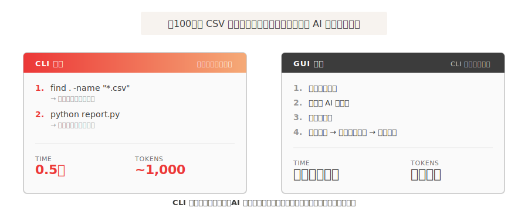
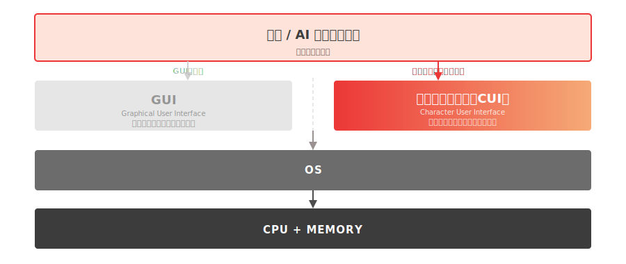
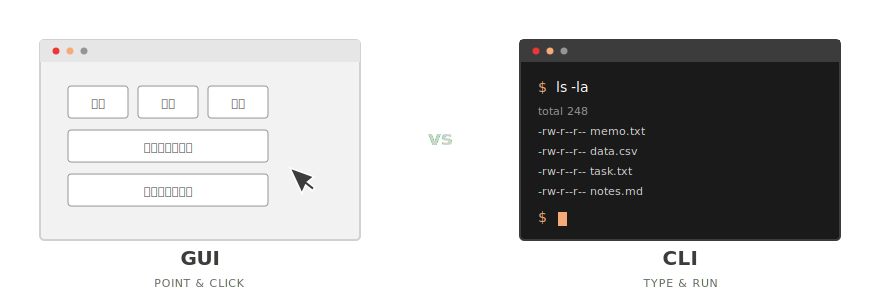

<!-- _class: cover -->

<p class="eyebrow">MINEDIA / TECH SESSION — 2026</p>

# AI時代のコマンドライン入門
## 〜エンジニアだけの道具から、AIを使う全員の道具へ〜

<p class="eyebrow" style="margin-top:2em">松倉 友樹 — Minedia, Inc. CTO</p>

---

<!-- _class: section -->

<p class="eyebrow">SECTION</p>
<div class="section-number">00</div>

# なぜ今、CLI なのか

---

## なぜ今、コマンドライン（CLI）なのか

- **AI エージェントが CLI（Command Line Interface）を前提に動くようになったから** — Claude Code・Cursor・MCP はテキスト＝コマンドラインを介して動く。GUI（Graphical User Interface）だけでは AI を使いきれない。

- **AI が出す指示を受け取るために必要だから** — 「このコマンドを実行してください」で詰まると、そこで止まる。読んで・直して・実行できると先に進める。

- **これからの業務で必要な場面が増えていくから** — MCP 連携・会社の Skills の設定・自動化スクリプトの実行、どれもターミナルが起点になる。

- **何十年分のコマンド・ライブラリがそのまま使えるから** — 画像処理・データ集計・API 連携など、必要な処理はほぼすでにある。コマンドラインを知っていると、それらに手が届く。

---

## Claude Code × CLI でできること — このスライドが実例

<div class="callout">

**この資料は、Claude Code で作りました。**
Markdown（テキスト）で書いて「図を追加して」「レイアウトを整えて」と指示するだけ。
CLI があるから、AI がファイルを直接読み書き・ビルドできる。

</div>

**CLI があると、できることの幅が変わる。**

- AI が書いたスクリプトを受け取って、自分で動かせる
- MCP サーバーや会社の Skills の設定・起動ができる
- 繰り返し作業をスクリプトに置き換えて自動化できる
- コマンド1行で完結するので、**実行のオーバーヘッドが少ない**

---

## Claude Code の動き方も変わる



---

## Claude Code の使い方は2つある

**どちらも Claude Code。でも、できることが違う。**

|  | デスクトップアプリ内で使う | ターミナルで `claude` と打つ |
|---|---|---|
| 起動 | アプリを開く | ターミナルで `claude` |
| 作業対象 | アプリが管理する範囲 | **起動したフォルダとその中身** |
| ファイル操作 | アプリ経由 | **直接読み書き・コマンド実行** |
| 自動化・定期実行 | できない | **スクリプトに組み込める** |

<div class="callout">

CLI から使うと、AI がファイルを直接読み書きしてコマンドを実行できる。

</div>

---

## CLI が必要になる場面 — 身近な例

| 場面 | 何が必要か |
|---|---|
| **MCP サーバーと連携する** | サーバーの起動・設定がターミナルから |
| **会社のサービスを動かす** | デプロイ・ログ確認・環境設定がCLI |
| **会社の Skills を使う・作る** | Skills の設置・更新・動作確認がターミナルから |
| **Claude Code に自動化を頼む** | 結果のスクリプトを自分で実行・改造する |

<div class="callout">

「Claude Code に頼んだらコマンドが返ってきた」——その先が動かせるかどうか、ここで差がつく。

</div>

---

<!-- _class: quote -->

> CLI がわかれば、AI への指示精度が上がる。
> AI が出したコマンドを読んで、確認して、改造できる。
> A2A・エージェントハーネスが広がるほど、CLI の基礎知識が役に立つ場面が増えていく。

<p class="attribution">今日の 60 分は、その土台を体に入れる時間。</p>

---

## 🎯 この講座のターゲット

**Claude Code は入れたけど、まだうまく活用できていない人**のための講座です。

**こんな人に向けて：**
- インストールはしたが、**どう使えばいいのかよくわからない**
- 「ターミナルでこれを実行してください」で**詰まる**
- 出てきたコマンドの**意味がわからない**ので、言われたまま貼るしかない
- カレントディレクトリ・環境変数・パス と聞いて**ピンと来ない**

**前提：** Claude Code はインストール済み、ノート PC 持参（Mac / Windows 対応）

---

## 今日のゴール

**Claude Code を使いこなす上で必要になる CLI の基礎知識を身につける。**

その土台として、受講後に以下ができるようになります。

1. ターミナルを**自分で開ける**
2. カレントディレクトリ・`~`（チルダ）の概念を**説明できる**
3. 基本のファイル操作コマンドが**打てる**
4. `find` / `grep` で **探せる**
5. 環境変数 `PATH` を**覗いて意味がわかる**
6. ★ **Claude Code を自分で起動して、業務を任せられるようになる**

---

## 🔧 環境チェック

**Mac** — ターミナルは標準搭載。**追加インストール不要**。

**Windows** — Git Bash を使います（事前案内済み）。
スタートメニュー → `Git Bash` で起動できることを確認。

<div class="callout">

起動できない場合は今のうちに講師か Slack `#ai` まで。

</div>

---

<!-- _class: section -->

<p class="eyebrow">SECTION</p>
<div class="section-number">01</div>

# CLI と GUI の違い

---

## コンピュータの層構造



---

## CLI と GUI — 2つの「PCの動かし方」



|  | GUI | CLI |
|---|---|---|
| 大量処理 | 苦手（1個ずつ） | 得意（1コマンドで何百個も） |
| 自動化 | 難しい | カンタン |
| AI との相性 | 悪い | **良い** |


---

## 🖐 ハンズオン ①：ターミナルを開く

**Mac** : `Cmd + Space` → `ターミナル` → Enter

**Windows** : スタートメニュー → `Git Bash`

**動作確認** — 全員で打つ：

```bash
echo Hello
```

<div class="callout">

`Hello` が表示されたら成功！

</div>

<!--
講師ノート:
- PowerShell が開いてしまった Windows ユーザーは Git Bash を開き直す。
- Windows は「スタートメニュー検索で Git Bash を探す」1つの方法だけ伝える。
-->

---

<!-- _class: section -->

<p class="eyebrow">SECTION</p>
<div class="section-number">02</div>

# シェルとコマンドの基礎

---

## シェルとコマンドの文法

**シェル** = あなたと PC の間に立つ通訳（bash / zsh）


<div class="callout">

CLI で打つもの = **スペースで区切った単語の列**。
一番左がコマンド、右はすべて追加指示。

</div>

**困ったら** `--help` を付ける：`ls --help` / `claude --help`

---

## 🖐 ハンズオン ②：基本コマンド 5 つ

| コマンド | 意味 | 試す |
|---|---|---|
| `pwd` | 今いる場所を表示 | `pwd` |
| `ls`  | 中身を一覧 | `ls`、`ls -la` |
| `cd`  | 場所を移動 | `cd ~` |
| `echo` | 文字を表示 | `echo Hello, World` |
| `cat` | ファイルの中身を表示 | （後で使う） |

**Tab キー** で補完、**↑キー** で履歴 — 今日中に体で覚える。

---

## ⌨️ まず覚えるショートカット

<div class="callout">

**`Ctrl + C`** — 実行中のコマンドを止める

</div>

「何か止まらない！」「ハマった！」→ **まず `Ctrl + C`**

```bash
sleep 100   # ← 実行してみる → Ctrl + C で止める
```


<!--
講師ノート:
- sleep 100 を実際に打って Ctrl+C で止めて見せる。体で覚えさせる。
-->

---

<!-- _class: section -->

<p class="eyebrow">SECTION</p>
<div class="section-number">03</div>

# ファイル・ディレクトリ操作

---

## カレントディレクトリと Claude Code

すべてのコマンドは **カレントディレクトリ**（今いる場所）を基準に動く。

- **ホームディレクトリ** = 「家」。Mac: `/Users/<あなた>` / Windows: `C:\Users\<あなた>`
- **`~`（チルダ）** = ホームの省略記号。`cd ~` でどこからでも家に帰れる
- 絶対パス：`/Users/yuki/cli-handson` / 相対パス：`cli-handson`（今いる場所から）

<div class="callout">

Claude Code は **起動した場所のフォルダが 基準**。
`cd ~/cli-handson` してから `claude` を起動するのはそのため。

</div>

---

## チルダ `~` の入力方法

<div class="callout">

**`~`** = ホームディレクトリ。読み方：**「チルダ」**（tilde）

</div>

| 環境 | キー操作 |
|---|---|
| Mac / Windows（JIS 配列） | `Shift + ^`（数字「0」の右隣） |
| Mac / Windows（US 配列） | `` Shift + ` ``（数字「1」の左） |

**使い方：**
- `cd ~` でどこからでもホームに戻れる
- `cd ~/Documents` でホーム起点のパスを指定
- プロンプトに `~` と出ていたら「今ホームにいる」サイン

---

## 🖐 ハンズオン ③：作る・複製・移動・消す

```bash
cd ~
mkdir cli-handson             # フォルダを作る
cd cli-handson
echo "Hello CLI" > memo.txt   # ファイルを作る（> はファイルに書き込む記号）
ls
cat memo.txt                  # 中身を表示
cp memo.txt note.txt          # コピー
mv note.txt log.txt           # 名前変更
rm log.txt                    # 削除
ls
```

<div class="callout">

`mkdir` `cp` `mv` `rm` — **作る・複製・移動・消す** の 4 つで全操作できる。

</div>

---

<!-- _class: dark -->

## ⚠️ `rm` は **ゴミ箱を経由しない**

`rm` で消したファイルは**即・完全に消える**。戻せない。

```bash
rm -rf /   # ← 絶対やってはいけない。PC が死ぬ
```

**安全策：消す代わりに `mv` で退避**

```bash
mv test.md old-test.md
```

<div class="callout">

**`rm` する前に必ず `ls` で確認する。**

</div>

---

<!-- _class: section -->

<p class="eyebrow">SECTION</p>
<div class="section-number">04</div>

# 探す：`find` と `grep`

---

## `find` と `grep` — ファイルを探す2つのコマンド

**`find` — 名前で探す**

```bash
find . -name "memo.txt"    # カレント以下から探す
find ~ -name "report.txt"  # ホーム以下から探す
```

**`grep` — 中身で探す**

```bash
grep "Hello" memo.txt   # ファイルの中で "Hello" を含む行
grep -r "TODO" .        # カレント以下を全部再帰検索
grep -rn "TODO" .       # 行番号付き
```

<div class="callout">

`ls` は「今ここだけ」、`find` は「**サブフォルダも全部**」。

</div>

---

## 🖐 ハンズオン ④：探す

```bash
cd ~/cli-handson
echo "TODO: write later" > task.txt
echo "Hello again"       > greeting.txt

find . -name "task.txt"   # 名前で探す
grep "Hello" memo.txt     # 中身で探す
grep -r "TODO" .          # 全ファイルから探す
```

<div class="callout">

Claude Code も内部でこれと同じことをやっている。
`find` / `grep` を自分で打てると、AI の動作を追いやすくなる。

</div>

---

<!-- _class: section -->

<p class="eyebrow">SECTION</p>
<div class="section-number">05</div>

# 環境変数

---

## 環境変数 — なぜ API キーを入れるのか

**環境変数** = 実行中のプログラム全体で共有される「名前 = 値」のメモ

```bash
echo $HOME   # /Users/yuki
echo $PATH   # コマンドを探しに行く場所のリスト
```

<div class="callout">

API キーなどの**認証情報はコードに直接書かない**のが一般的。
コードに書いてしまうと、プログラムを共有できなくなる（認証情報ごと渡すことになる）し、情報漏洩リスクも高まる。

</div>

```bash
# ❌ プログラムにキーを直接書く → 共有できない・漏れる
# ✅ 環境変数に入れておけば、プログラムは名前で読むだけ
export ANTHROPIC_API_KEY="sk-ant-abc123..."
echo $ANTHROPIC_API_KEY   # → 値が取り出せる
```

---

## 環境変数の種類

**① OS が自動でセットする変数**

`PATH` `HOME` `SHELL` `PWD` など — 触らなくても最初から入っている

**② 慣習的に決まっている変数** — 名前はルールではないが広く使われる

`EDITOR`（デフォルトのエディタ）`LANG`（言語設定）`PAGER`（ページャー）など

**③ 自分で追加する変数** — 名前も値も自由に決められる

`ANTHROPIC_API_KEY` `OPENAI_API_KEY` など API キーや独自の設定値

慣習：すべて `大文字_アンダースコア` で命名する

---

## 🖐 ハンズオン ⑤：`PATH` を覗く

```bash
echo $PATH
```

→ コロン `:` で区切られた、フォルダのリストが出てくる。

<div class="callout">

ここに含まれているフォルダの中の実行ファイルだけが、**「名前だけ」で起動できる**。
`claude` と打つと動くのは、`PATH` のどこかに `claude` があるから。

</div>

<!--
講師ノート:
- PowerShell では $env:PATH。Git Bash 統一なので $PATH でOK。
-->

---

<!-- _class: section -->

<p class="eyebrow">SECTION</p>
<div class="section-number">06</div>

# Claude Code を自分で動かす

---

## 🖐 ハンズオン ⑥：Claude Code を起動して頼む

**① 作業フォルダに移動して起動**

```bash
cd ~/cli-handson
claude
```

→ Claude Code が立ち上がる。**起動した場所が 基準**。

**② 自然言語で頼んでみる**

> 「Hacker News（news.ycombinator.com）のトップ記事を10件取得して、タイトルとURLをまとめた report.md を作って」

Claude Code が裏でやること：
- `curl` でページを取得
- 内容をパース・整理
- `report.md` としてファイルに書き出す

<div class="callout">

終わったら `cat report.md` で中身を確認。**Web から情報を取ってきてファイルに保存する**、まで自分で動かせた。

</div>

---

## 応用例 — X 投稿のドラフトを作る

```
❯ マインディアCTOとしてXに投稿するから (@matsubokkuri)
  投稿文のドラフトを3個作って
```

Claude Code が生成したドラフト（抜粋）：

> MicrosoftがMAI-Code-1-Flashを発表。コード生成モデルの「軽量・高速」競争が本格化してきた。
> レイテンシが業務に直結する領域では、巨大モデルより小回りの効くFlash系が刺さる場面が確実に増える。
> マインディアでも検証していきたい。

→ トーン・ペルソナ・テーマ違いで **3案** を7秒で生成。

<div class="callout">

自然言語で指示するだけ。コマンドを知っていると、Claude Code が使えるコンテキストが広がる。

</div>

---

<!-- _class: dark -->

# 🎉 ゴール達成

あなたは今、

✅ ターミナルを自分で開いた
✅ コマンドの文法を覚えた
✅ ファイルを操作した
✅ ファイルと中身を探した（find / grep）
✅ 環境変数を覗いた
✅ **Claude Code を起動して、業務を自然言語で任せた**

これで、Claude Code も、もう怖くない。

---

## 📚 次に覚えると効くコマンド

| コマンド | できること |
|---|---|
| `curl` | API を叩く / ファイルをダウンロード |
| `head` / `tail` | ファイルの先頭・末尾だけ表示 |
| `wc -l` | 行数カウント（「データ何件？」の即答） |
| `open .` / `explorer .` | 今のフォルダを GUI で開く |
| `diff` | ファイル比較 |
| `vim` / `nvim` | CLI 上でファイルを編集する |

---

<!-- _class: section -->

<p class="eyebrow">SECTION</p>
<div class="section-number">07</div>

# 応用デモ
## 「この先こんなことができる」

---

## デモ ① — CLI でできること（見せるだけ）

**100 枚の画像を一括リサイズ**

```bash
sips -Z 800 *.jpg   # Mac
```

→ GUI でやると 2 時間 → **1 コマンドで完了**

**ターミナルのサプライズ**

```bash
cal 9 1752   # 1752年9月 — 日付が飛んでいる！
```

→ 英国がユリウス暦からグレゴリウス暦へ切替えた際に 9月3〜13日が消えた。その記録が CLI に残る。

<!--
講師ノート:
- cal 9 1752 は受講者の反応が良い定番ネタ。
- Git Bash に cal がない場合は date で代替。
-->

---

## デモ ② — Claude Code に実務を任せる

> 「このフォルダの CSV を集計して、月次レポートを作って」

裏で Claude Code が使うもの：

- `ls` / `find` でファイルを探す
- `cat` で中身を読む
- `grep` で必要な行を抽出
- スクリプトを書いて実行

<div class="callout">

CLI の基礎を知っていると、Claude Code が何をしているか追いやすくなる。

</div>

---

## デモ ③ — 技術ブログを書く・校正する

**指示したこと：**

> 「`../bunshin/` にあるアプリケーションを作ったから、技術ブログを書いて」

**Claude Code がやったこと：**
- プロジェクトのコード・README・設計を読む
- 構成（3秒まとめ・対象読者・実験結果）を考える
- Zenn 形式の Markdown で記事を生成

**実際に公開された記事：**
`zenn.dev/minedia/articles/2026-05-25-ai-consumer-panel-digital-twin`

> 「アンケート回答を代替するLLM個人モデルの構築と精度検証：N=1予備実験」

<div class="callout">

コードを書いた人が「ブログ書いて」と頼むだけで、技術記事の初稿が出る。

</div>

---

## デモ ④ — インタビュー文字起こしからインサイト抽出

**指示したこと：**

> 「`txt/` フォルダにある5人分の文字起こしを読んで、共通の課題・現在の代替手段・ポジティブな反応をまとめた調査レポートを `report.md` で出力して」

**Claude Code がやったこと：**
- フォルダ内の全 `.txt` を `find` で取得・`cat` で読み込み
- 横断的にテーマを抽出して構造化
- Markdown レポートとして書き出し

<div class="callout">

膨大なテキストの読み込みと要約をローカルで処理。**コピペ不要、即レポート化。**

</div>

---

## デモ ⑤ — 複数媒体の広告レポートを一本化

**指示したこと：**

> 「このフォルダにある Google・Meta・Yahoo の広告 CSV を読み込んで、日別・媒体別の imp / click / 消化金額を統合した `master_report.csv` を作って」

**Claude Code がやったこと：**
- 各 CSV のフォーマット差異を自動で吸収
- 列を統一して結合・集計
- `master_report.csv` として保存

<div class="callout">

毎週やっていた「Excelでコピペ統合」が、指示1回で終わる。

</div>

---

<!-- _class: section -->

<p class="eyebrow">SECTION</p>
<div class="section-number">08</div>

# クロージング

---

## 第2回があるとしたら ── 今日の先にある世界

| テーマ | 代表コマンド・概念 | できるようになること |
|---|---|---|
| 標準入出力・パイプ | `\|` `>` `>>` | コマンドを繋いで「流れ作業」を作る |
| プロセス・ジョブ管理 | `ps` `kill` `jobs` `&` | 動いているものを見る・止める・裏で走らせる |
| テキスト処理 | `awk` `sed` `sort` | CSV・ログを CLI だけで集計・変換 |
| シェルスクリプト | `if` `for` `.sh` | 繰り返し作業を1ファイルで自動化 |
| 環境構築 | `.zshrc` `alias` | 自分専用のターミナルを育てる |

<div class="callout">

**今日の基礎があるから、次が楽しくなる。**

</div>

---

<!-- _class: closing -->

# ありがとうございました

資料リポジトリ：**github.com/minedia/cli-basics**
